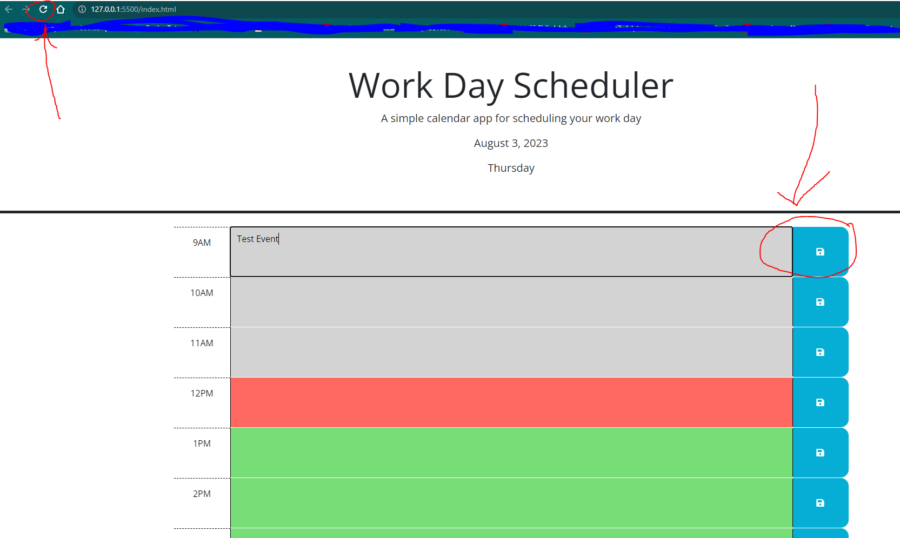
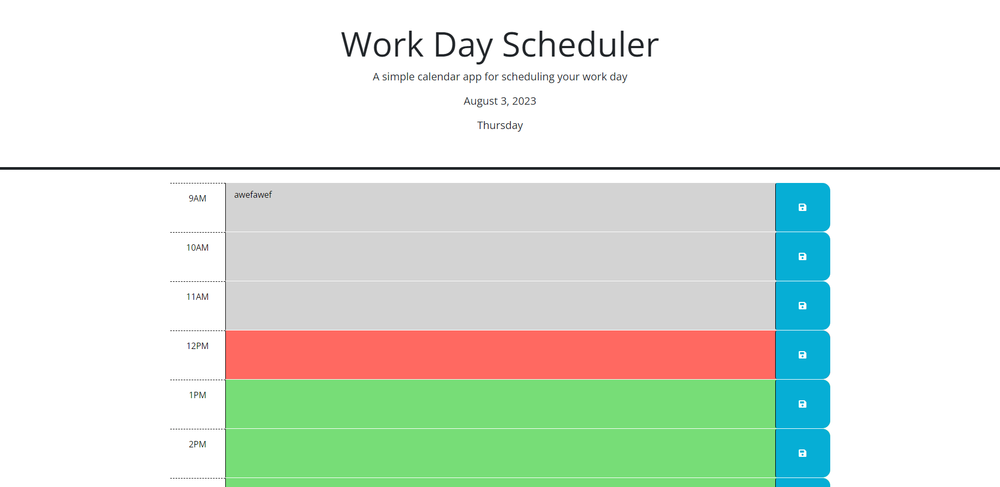

# Work-Day-Scheduler

# Description
This repository is for a simple calendar application that allows users to save events during a typical work day in hourly blocks. The application was created in order to provide users the ability to create a calendar for their work day and save those items so that the next time they load the page the events will appear in the time slots in which they were saved. As a software developer, from creating this application, I was able to test my fundamentals of JavaScript and learn to use DOM APIs to manipulate HTML elements. I was also able to showcase my understanding of localStorage and how it can be used to save information and load it on the page when needed.

# Usage
In order to use this application, first, you will need to go to the application landing page which can be found here, https://kevalpatel6.github.io/Work-Day-Scheduler/. On the landing page you can see the current date and the day of the week. If you scroll down you can see the hours of a typical work day (9am-5pm). 

As a user, you will be able to click on the time slot text area and type in anything that you want. Typically, a user will fill out an event or a to-do item in this text area. After typing in an event or to-do item, you will need to hit the save button with a save icon on the right hand side of the text area in order for the event to be saved. 

Below you can see a screenshot of the landing page with the current date and day of the week at the top. Circled in red on the right, you can see the save icon, which will save the Test Event to local storage for the appropriate time slot. Upon refresh (circled in red on the left), the Test event will be loaded onto the page. 

On page refresh the event text should populate in the appropriate time slot. 

Additionally, the work day is color coded to reflect the past, present, and future events. The gray background colored time slots indicate past events for hours that have already passed by. The red background color indicates the present hour and the green background color represents future events.

As an example of the above color coordination, you can see the screen shot below with the current hour set to 12pm. 

## Credits

Credit to my tutor Joem Casusi for helping me with the local storage issue I was having.

# License
MIT License

Copyright (c) [2023] [Keval Patel]

Permission is hereby granted, free of charge, to any person obtaining a copy of this software and associated documentation files (the "Software"), to deal in the Software without restriction, including without limitation the rights to use, copy, modify, merge, publish, distribute, sublicense, and/or sell copies of the Software, and to permit persons to whom the Software is furnished to do so, subject to the following conditions:

The above copyright notice and this permission notice shall be included in all copies or substantial portions of the Software.

THE SOFTWARE IS PROVIDED "AS IS", WITHOUT WARRANTY OF ANY KIND, EXPRESS OR IMPLIED, INCLUDING BUT NOT LIMITED TO THE WARRANTIES OF MERCHANTABILITY, FITNESS FOR A PARTICULAR PURPOSE AND NONINFRINGEMENT. IN NO EVENT SHALL THE AUTHORS OR COPYRIGHT HOLDERS BE LIABLE FOR ANY CLAIM, DAMAGES OR OTHER LIABILITY, WHETHER IN AN ACTION OF CONTRACT, TORT OR OTHERWISE, ARISING FROM, OUT OF OR IN CONNECTION WITH THE SOFTWARE OR THE USE OR OTHER DEALINGS IN THE SOFTWARE.